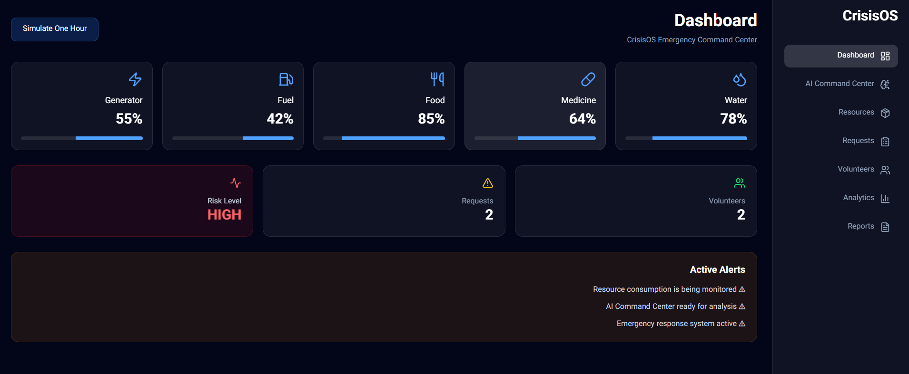
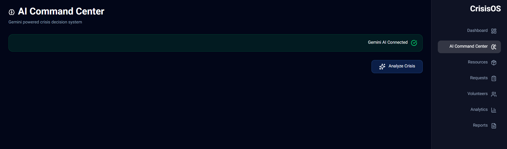
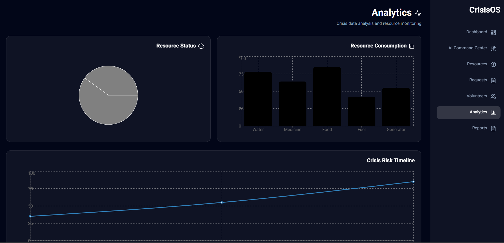
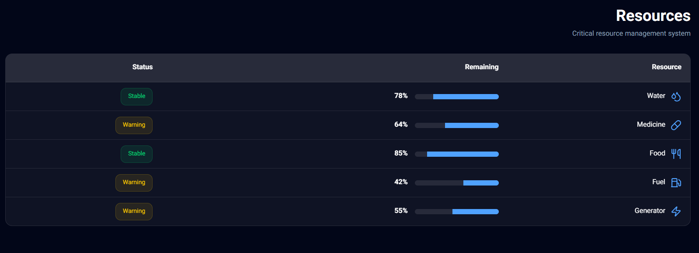
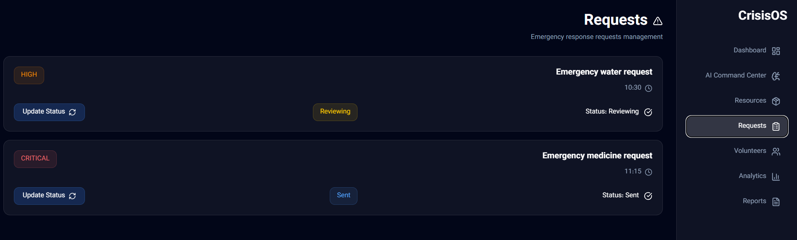
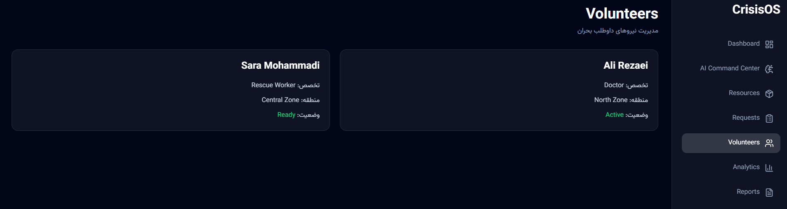

#  CrisisOS

## AI-Powered Crisis Management Dashboard

CrisisOS is a modern crisis management platform designed to monitor critical resources, analyze emergency situations, manage requests and volunteers, and provide AI-powered operational recommendations.

Built with React, Vite, TailwindCSS, and Google Gemini AI.

---
##  Live Demo

https://crisisos-ai-dashboard.vercel.app/

---

##  Overview

CrisisOS simulates a real-world emergency command center where operators can:

* Monitor available resources
* Track emergency requests
* Manage volunteer teams
* Analyze crisis conditions using AI
* Visualize operational data
* Generate crisis reports

The system combines a modern dashboard interface with artificial intelligence to support faster decision-making during critical situations.

---

#  Features

##  Command Dashboard

* Real-time resource monitoring
* Crisis risk level indicator
* Emergency overview cards
* Crisis simulation engine



---

##  AI Crisis Analysis

Powered by Google Gemini AI.

Capabilities:

* Risk assessment
* Crisis summary generation
* Recommended actions
* Resource planning
* Future prediction



---

##  Analytics

Interactive visualization of:

* Resource consumption
* Resource status distribution
* Crisis risk trends



---

##  Resource Management

Track critical resources:

* Water
* Medicine
* Food
* Fuel
* Generator



---

##  Emergency Requests

Manage incoming emergency requests and update their status.



---

## Volunteer Management

Monitor:

* Volunteer skills
* Assigned areas
* Availability status



---

#  Tech Stack

## Frontend

* React
* Vite
* TailwindCSS
* React Router

## Data Visualization

* Recharts

## Artificial Intelligence

* Google Gemini API

## PDF Generation

* jsPDF

---

#  Project Structure

```
src
│
├── components
│   ├── Layout.jsx
│   └── Sidebar.jsx
│
├── context
│   └── CrisisContext.jsx
│
├── pages
│   ├── Dashboard.jsx
│   ├── AICommandCenter.jsx
│   ├── Analytics.jsx
│   ├── Resources.jsx
│   ├── Requests.jsx
│   └── Volunteers.jsx
│
├── services
│   ├── geminiService.js
│   └── pdfService.js
│
└── utils
```

---

#  Installation

Clone the repository:

```bash
git clone git@github.com:yassin-bera/crisisos-ai-dashboard.git
```

Navigate into the project:

```bash
cd crisisos-ai-dashboard
```

Install dependencies:

```bash
npm install
```

Run development server:

```bash
npm run dev
```

---

#  Environment Variables

Create a `.env` file:

```env
VITE_GEMINI_API_KEY=your_gemini_api_key
```

---

#  AI Architecture

CrisisOS sends crisis data to Gemini AI and receives structured analysis including:

* Current risk level
* Situation summary
* Recommended actions
* Resource strategy
* Future predictions

---

#  Future Improvements

Possible future features:

* Real-time database integration
* User authentication
* Live emergency maps
* IoT sensor integration
* Multi-user command center
* Advanced AI forecasting

---

#  Author

**Yassin Beyrami**

GitHub:
https://github.com/yassin-bera
